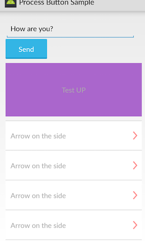

# Rock Button
[  ](https://bintray.com/jjhesk/maven/hkmprocessbuttons/_latestVersion)[](http://android-arsenal.com/details/1/1691)[](https://gratipay.com/jjhesk/) [release log](https://github.com/jjhesk/hkm-progress-button/releases)[](https://waffle.io/jjhesk/hkm-progress-button)

Base on android-process-button this is the advanced version of the android-process-button
[](https://circleci.com/gh/jjhesk/hkm-progress-button/tree/master)

##Main Features
- [x] ActionProcessButton
- [x] ArrowButton
- [x] GenerateProcessButton
- [x] SubmitProcessButton
- [x] AnimationProcessButton

Android Buttons With Built-in Progress Meters.





### Read more with the development guide in Wiki
- [Home](https://github.com/jjhesk/hkm-progress-button/wiki)
- [Support XML attributes](https://github.com/jjhesk/hkm-progress-button/blob/master/library/src/main/res/values/styles.xml)

### Attributes

There are several attributes you can set:

| attr | description| button module base |
| :---- | :---- | :---- |
| pb_textProgress| the text content when the process is proceeding | ProcessButton |
| pb_textComplete| the complete text |ProcessButton |
| pb_textError| error message on the button | ProcessButton |
| pb_colorProgress| the color resource reference on process |ProcessButton|
| pb_colorComplete| the color resource reference on process completed|ProcessButton |
| pb_colorError| the color resource reference when its error |ProcessButton |
| pb_colorPressed| as read | FlatButton |
| pb_colorNormal|  as read | FlatButton |
| pb_colorDisabled|  as read | FlatButton |
| pb_colorBorder| as read | FlatButton |
| pb_borderWidth| as read | FlatButton |
| pb_cornerRadius| as read | FlatButton |
| pb_presentation| as read there are two options: pad_button, flat_button | FlatButton |
| pb_colorArrow| color reference to tint the arrow | ArrowButton |
| pb_arrowRes| the drawable reference for the button | ArrowButton |
| pb_verticalPadding|dimension reference padding between top and bottom on the icon on right side | ArrowButton |
| pb_topLineThickness| dimension reference for the line thickness on the top | ArrowButton |
| pb_bottomLineThickness| dimension reference for the line thickness on the bottom | ArrowButton |

## Code Sample
```java

        add_bag = (ActionProcessButton) findViewById(R.id.add_to_bag);
        add_bag.setCompleteText(act.getResources().getString(R.string.button_3));
        add_bag.setText(act.getResources().getString(R.string.button_1));
        // set the progress mode on endless
        add_bag.setMode(ActionProcessButton.Mode.ENDLESS);
        // add success state color scheme as a button and not a sign
        add_bag.setOnCompleteColorButton(R.color.green_800, R.color.green_900);
        // add listener for click on the button for success state
        add_bag.setOnClickCompleteState(new View.OnClickListener() {
            @Override
            public void onClick(View v) {
                Intent h = new Intent(context, CartWebViewStyleTopBar.class);
                context.startActivity(h);
            }
        }).build();
        
```
### Integration

The lib is available on maven jitpack, so you will need to add a class path for custom repos

```gradle

repositories {maven { url "http://dl.bintray.com/jjhesk/maven" }}
dependencies {compile 'com.hkm:hkmprocessbuttons:1.2.4'}
```

### Sample

<a href="https://play.google.com/store/apps/details?id=com.dd.sample.processbutton">
  
</a>
<a href="https://play.google.com/store/apps/details?id=com.inappsquared.devappsdirect">
  
</a>

### Status

[](https://waffle.io/jjhesk/hkm-progress-button/metrics)
